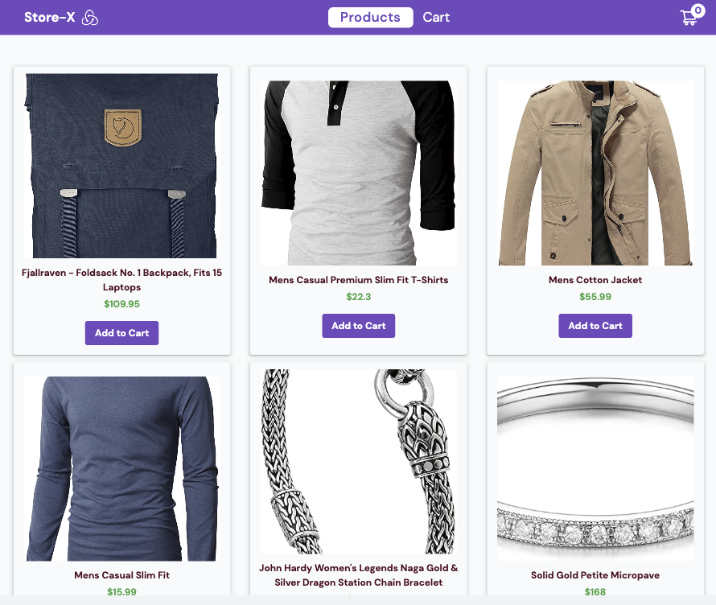
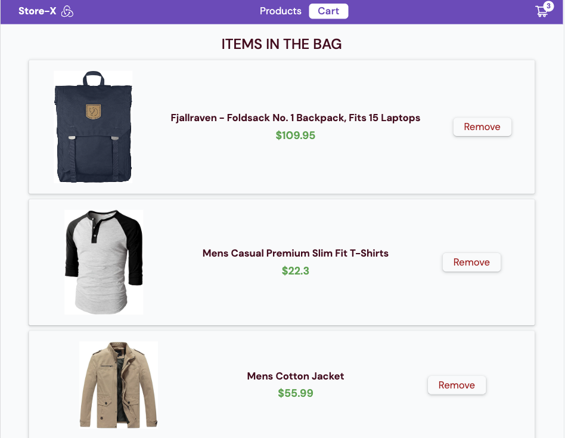
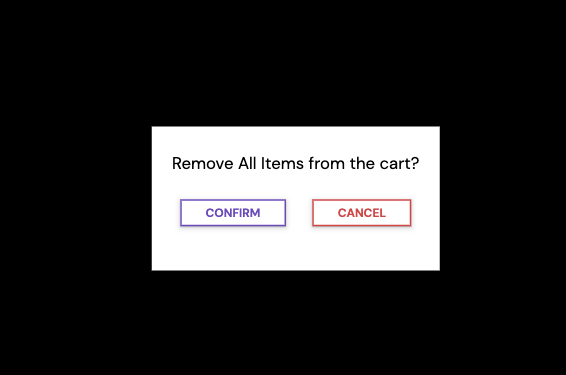

# Redux Cart Project

This is a simple project showcasing the use of Redux for state management in a React application. The project demonstrates how to manage state with Redux, including features such as adding items to the cart, removing items, clearing the cart, and utilizing a modal component. The project also utilizes Vite as the development tool, Tailwind CSS for styling, and async thunk middleware for fetching product data from the FakeStore API.

## Features

- **Redux**: The project utilizes Redux to manage the application's state, providing a centralized and predictable way of handling data.

- **Vite**: Vite is used as the build tool, providing fast and optimized development and production builds.

- **Tailwind CSS**: Tailwind CSS is employed for styling the user interface, offering a utility-first approach that enables rapid development and customization.

- **Async Thunk**: The project utilizes the async thunk middleware for handling asynchronous actions, such as fetching product data from the FakeStore API.

## Installation

1. Clone the repository:

   ```
   git clone https://github.com/pradeepkhanal23/redux-project.git
   ```

2. Install the dependencies:

   ```
   cd redux-project
   npm install
   ```

3. Start the development server:

   ```
   npm run dev
   ```

4. Open your browser and visit `http://localhost:3000` to view the application.

## Screenshots


_Screenshot of the homepage showcasing product listings and cart functionality._


_Screenshot of the cart component showcasing product details._



_Screenshot of the modal component displaying actions to be dispatched._

## Acknowledgements

This simple Redux project highlights my ability to effectively use Redux for state management in React applications. It showcases features such as adding items to the cart, removing items, and clearing the cart, while also utilizing the async thunk middleware for handling asynchronous actions. The project also demonstrates my proficiency in using Vite as the build tool and Tailwind CSS for styling the user interface.

## Limitations

- This project is intentionally kept simple to showcase the implementation of Redux for state management in React. It does not include advanced features such as user authentication, payment integration, or complex data manipulation.

- While the project utilizes Redux for state management, it does not include certain features that could enhance the user experience, such as an added-to-cart alert or other real-time features like increasing the cart items, calculating the totals and amounts respectively in the cart component.

- The current version of the project focuses on the basic functionality of managing state with Redux. However, there is room for further development and improvement. Future iterations of the project could potentially include additional features like search functionality, cart alerts and other dynamic features.

## License

This project is licensed under the [MIT License](LICENSE). Feel free to modify and adapt it to suit your needs.
